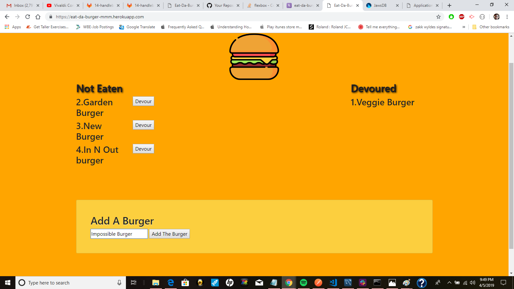
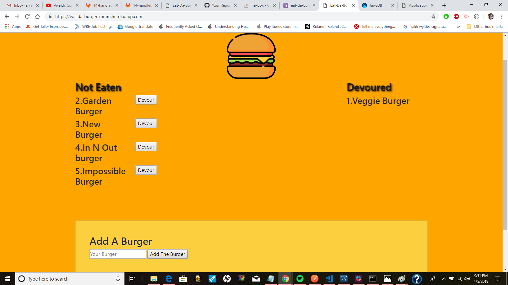
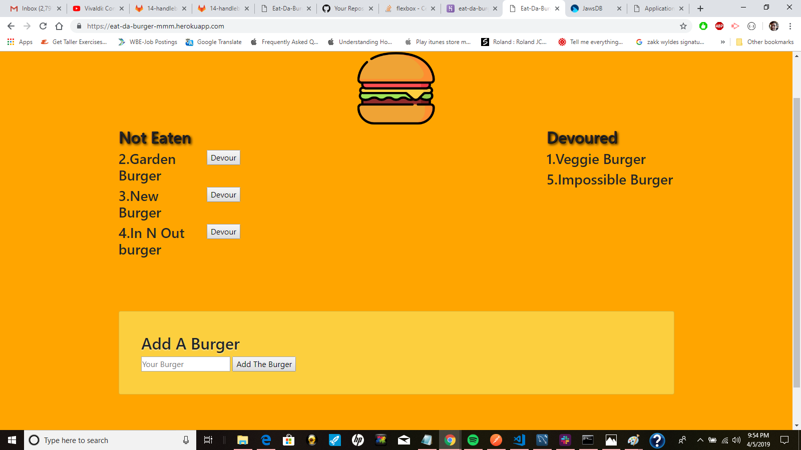
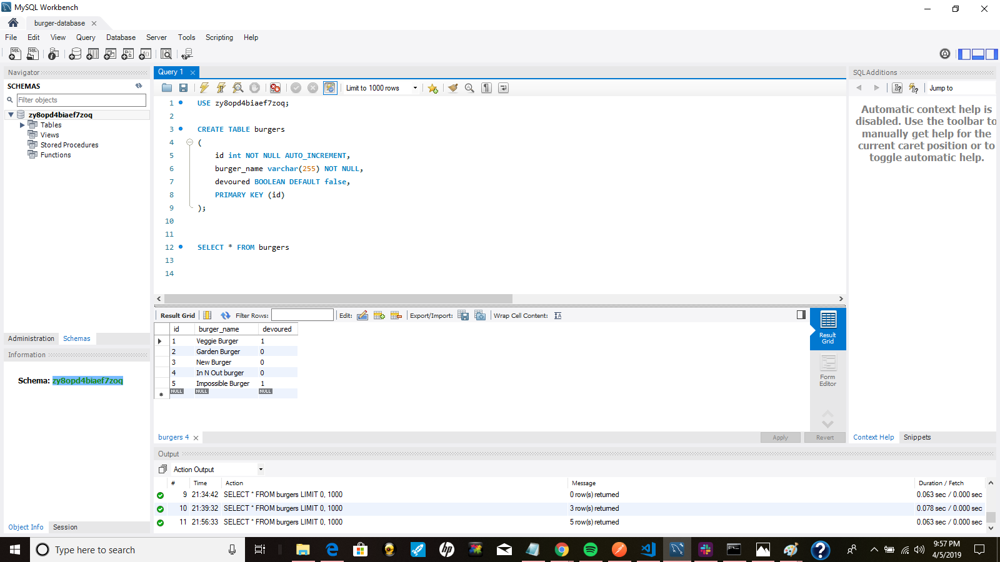

# Eat-Da-Burger

In this application, I created a burger logger with MySQL, Node, Node Express package, Handlebars and a homemade ORM (Object Relational Maping). I followed the MVC (Model, View, Controller) design pattern.  Node and MySQL were used to query and route data in my app, and Handlebars to generate my HTML.

This is a **full stack application**. It is deployed on the web via heroku which is communicating to my backend server on mySQL Workbench on my computer. I used Boostrap for the CSS styling.

# To use the app we first need to "add a burger."

 

**Example 1** I am going to add the "Impossible burger" and hit the **"Add The Burger"** button.

 

 **Example 2** This burger is now part of the **"Not Eaten"** column. It is the 5th burger I've added to my database.  That is why the number "5" is next to it. 

 

 

 **Example 3** I can either leave the burger there or "devour" it by hitting the **"Devour"** button.  I've decided to devour it. This burger now moves to the left **"Devoured column"**

 

 **Example 4** If I check mySQL database, I can see the list of burgers I've added.  Notice that the "Not Eaten" burgers have a "0".  This is binary code which basically means "false." The "Devoured" burgers are set to "true."  That is why "Veggie Burger" and "Impossible Burger" both have a "1."

My table is called "burgers" and all the burgers will be stored inside of it. Each burger "ID" number goes up by 1 every time a burger is added.  On the front-end "Impossible Burger" was number 5 and that is reflected here on the backend. You can see how my table was created.

